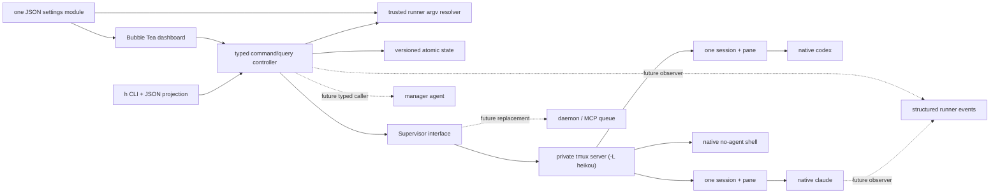

# Heikou design

## Product thesis

The fastest useful parallel-agent system is not a new agent runtime. It is a
high-quality control surface over the native runners people already trust.

Heikou V0 therefore optimizes one loop:

1. See every coding-agent session in one scan-friendly view.
2. Dispatch a new task without leaving the composer.
3. Preview and steer an existing session without opening it.
4. Attach to the exact native Codex or Claude terminal when full control is
   useful.
5. Detach back to the global view without stopping anything.

Durable workstreams now organize that loop without changing its execution
substrate. Structured signals and richer orchestration remain future observers
and callers of the same controller actions—not prerequisites for using the
dashboard.

## Research synthesis

### Claude Code Agent view

The closest production reference is Claude Code's [`claude agents` Agent
view](https://code.claude.com/docs/en/agent-view), not the in-session `/agents`
panel or experimental agent teams. Its strongest choices are:

- a sparse, full-terminal global list across directories;
- an always-available dispatch input at the bottom;
- action-oriented status ordering, with “needs input” prominent;
- a lightweight peek/reply layer before full attachment;
- direct attachment to the native conversation; and
- background work that survives leaving the dashboard.

Anthropic's implementation has a per-user supervisor and structured semantic
state, so Heikou cannot honestly reproduce all its statuses from tmux alone. The
V0 copies the interaction loop rather than pretending to copy the substrate.
Anthropic's [launch post](https://claude.com/blog/agent-view-in-claude-code) is
also useful visual evidence: compact rows, restrained status color, and almost
no card chrome.

### `zwarm`

The intended package appears to be [`zwarm`](https://pypi.org/project/zwarm/),
invoked as `uvx zwarm interactive`; the literal PyPI package named `swarm` is an
unrelated game. `zwarm` contributes useful vocabulary—spawn, list, peek, show,
watch, continue, kill—and a clean runner-adapter idea.

Its execution substrate is intentionally not reused. It launches headless
one-shot processes, redirects JSONL, and reconstructs follow-up context. That
makes raw native attachment and steering a running turn impossible. Heikou
inverts the design: the PTY-backed native session is truth, and structured logs
can become an optional observer later.

### TUI stack

Go plus [Bubble Tea v2](https://pkg.go.dev/charm.land/bubbletea/v2) is the right
V0 tradeoff:

- a single, quickly starting binary;
- an Elm-style state/update/view split;
- declarative alternate-screen and keyboard behavior; and
- `ExecProcess`, which suspends the dashboard, lends the terminal to tmux, and
  restores the dashboard afterward.

Rust with Ratatui/Crossterm remains a credible eventual foundation if profiling
or deeper terminal control justifies the extra implementation surface. The
runtime boundary below is intentionally independent of Bubble Tea.

## Architecture

The package boundaries are:

- `internal/heikou`: runner-neutral session types and the `Supervisor`
  contract;
- `internal/home`: the one directory holding every Heikou file, and the
  one-time migration from the earlier XDG layout;
- `internal/config`: the single JSON settings model and strict loader;
- `internal/workstream`: durable workstream/session/membership types and the
  versioned atomic store;
- `internal/control`: the sole join between durable organization and current
  runtime observation, including the closed typed actor/scope command plane;
- `internal/runner`: tiny Codex and Claude argv adapters plus the exec wrapper;
- `internal/supervisor`: the tmux implementation;
- `internal/ui`: typed screen reducers, their shared overview read model, and
  rendering; and
- `cmd/h`: human-facing CLI commands and dependency diagnostics.

There is no Heikou daemon in V0. The private tmux server already provides the
needed process lifetime and PTY ownership. It is isolated from the user's normal
tmux server and configured with zero-session persistence.

### Typed command plane

Every current human mutation enters `Controller.Execute` as a closed Go action
with an explicit actor and either installation or workstream scope. Convenience
methods used by the TUI and CLI construct the same `local_human` command rather
than bypassing that boundary. Structural validation runs before authorization,
and the default authorizer admits only the local human. A session actor is a
modeled future caller but is rejected until manager grants and their policy
exist.

This is deliberately a local in-process boundary, not yet a durable command
queue. There are no manager grants, command IDs, approvals, events, leases, or
outbox semantics in V0.3.4. Adding those later should strengthen this one path,
not create a manager-only mutation API.

Launch actions choose a backend, prompt, and root; they do not carry executable
argv. Immediately before a native launch, the controller asks a trusted
config-backed resolver for the configured argv prefix and passes that snapshot
to `Supervisor.Start`. This keeps human and future authorized callers from
substituting an arbitrary executable through the command payload.

## Session lifecycle

Before the first child starts, Heikou bootstraps the private server with:

- `exit-empty off`, so the supervisor can exist with zero sessions;
- global `remain-on-exit on`, so even an immediately failing runner leaves an
  inspectable pane and, when tmux reports it, an exit code;
- extended-key and passthrough support for modern agent TUIs;
- a large history buffer and `window-size latest`; and
- `Ctrl-\` as a root-table detach binding, in addition to normal `Ctrl-b d`.

The bootstrap marker is versioned so a later Heikou release can safely migrate
an already-running server's configuration. Environment variable *names* are
refreshed into tmux on each invocation; values are never embedded in a shell
command. Provider executables are resolved through that trusted configuration
boundary to absolute paths before spawn.
Codex resolution also checks known macOS application-bundle locations when the
bare `codex` name is absent from the login-shell `PATH`.

Each task becomes one tmux session and one canonical pane. The controller
allocates the UUID before launch; `Supervisor.Start` accepts that caller-owned
identity and never generates one. Metadata is encoded in tmux user options:

| Field | Purpose |
| --- | --- |
| stable UUID | Heikou identity; also supplied to Claude as its session ID |
| pane ID | immutable target for capture and input |
| runner | `codex`, `claude`, or `no-agent` |
| root | launch directory |
| initial prompt | stable list/detail fallback |
| started timestamp | elapsed runtime |

The ID is present in the tmux session name, environment, session metadata, and a
pane-scoped canonical marker in the same tmux command queue that creates the
session. Reconciliation therefore never depends on a successful later metadata
write. The tmux child directly invokes a small hidden Heikou exec mode with
argv—not a shell string. That process decodes metadata and replaces itself with
the native runner using `exec`. Prompts beginning with `-`, quotes, backticks,
and shell syntax remain literal.

`no-agent` deliberately takes a smaller path: Heikou omits the child command
from `tmux new-session`, so tmux starts its default interactive shell. The
composer text is retained only as the session label and is never injected into
that shell. Follow-up transport remains available, making this a cheap way to
test session creation, input, capture, attachment, and detachment without an
agent request.

### Settings

V0 has one settings file, normally `~/.heikou/config.json`. It contains a
default runner, argv arrays for Codex and Claude, and three composer bindings:
`reply`, `cycle_runner`, and `cycle_root`. Arrays preserve the exact
executable/flag boundary and avoid shell parsing. `reply` acts only on an empty
composer, where it is a mode switch rather than text; the cycle bindings act
regardless of composer content. All three are live simultaneously and therefore
may not share a key. `Enter` is the sole commit key and is deliberately not
configurable, since a rebindable commit key would reintroduce the ambiguity the
visible-destination model exists to remove.
Environment compatibility variables override JSON values; explicit CLI flags
select the runner and root. Command changes apply to new sessions only.

`Ctrl-S` opens a read-only settings view; `e` creates/opens the JSON file in the
user's editor and `r` reloads it. The view displays the active composer bindings
alongside launch commands. There are intentionally no forms, accounts, or
daemon-owned settings in this iteration.

### Durable workstreams

Workstream state is application data, not configuration. It normally lives at
`~/.heikou/state.json`, independently of `internal/config`, with ordinary
artifacts at `~/.heikou/workstreams/<id>/`. The JSON
sidecar remains versioned, mode `0600`, written by temp-file/fsync/rename, and
guarded by an advisory lock. Storage remains behind a repository interface so a
later SQLite implementation does not change the domain contract.

That directory is also where the **pilot** lives. Every organizing action the
controller exposes now has a CLI verb, so an ordinary agent running in
`~/.heikou` can maintain Heikou's durable state through the same typed command
plane the dashboard uses. Its instructions are embedded in the binary and
installed as `AGENTS.md`, a `CLAUDE.md` pointer, and
`skills/manage-heikou/SKILL.md`; existing files are never overwritten, so user
edits survive an upgrade and `h init --force` is the explicit refresh.

A new installation is seeded with a `heikou-managers` workstream rooted only at
the home directory, so a pilot can be launched from the dashboard without
hand-built setup. The signal is `FileStore.Exists`: reads never create the state
file and no-op mutations never write it, so its absence means nothing has ever
been recorded here. Keying off the workstream's own presence would have
resurrected one the user deleted on purpose, and a separate provisioning marker
would have been a second source of truth for a question the state file already
answers. An installation that already has state is never seeded implicitly;
`h init` is the explicit opt-in and the way back after a deletion.

A pilot receives no authority. It shells out to `h` and is therefore the local
human at that boundary, holding no grant and leaving `localHumanAuthorizer`
unchanged. Adding one does not enable session actors, and an authorizer rule
would be theater: a process with a shell can call any verb regardless of the
label attached to it. Scope comes from what the instructions teach and from
which verbs demand `--yes`. That is a guardrail against agent mistakes, not a
sandbox, and the distinction is deliberate.

`internal/home` owns that location and nothing else. Both `internal/config` and
`internal/workstream` resolve their paths through it, so the directory is
described in one place rather than derived independently three times. Keeping
settings, state, and artifacts in a single directory is also what makes the
directory a coherent working root for an agent that maintains Heikou's own
state: it can see its instructions, its notes, and its artifacts without being
handed three unrelated paths.

Relocation from the earlier three-directory XDG layout is an explicit one-time
migration at the process entry point, not a permanent dual-read fallback. It is
suppressed by `HEIKOU_HOME`, by an existing home directory, and per-path by any
individual override. Because `Workstream.ArtifactDir` is persisted absolute,
moving artifacts also repoints those recorded directories; that rewrite
deliberately leaves each workstream's revision and timestamps untouched, because
relocating files is not a domain edit.
State schema v2 adds the optional durable session title. The loader uses an
explicit ordered v1-to-v2 migration: it strictly validates the claimed v1
shape, migrates in memory, and atomically installs v2 while preserving the
domain revision. Invalid states, future versions, and fields unknown to the
claimed schema are rejected rather than rewritten.
The workstream array order is also its durable display order; moving an active
workstream swaps it with an active neighbor in one atomic state mutation and
does not require a separate position field or schema migration.

The deliberately small durable model is:

- `Workstream`: name, description, artifact directory, explicit roots,
  revision, timestamps, and optional archive time;
- `SessionRecord`: caller-owned launch ID, optional user-authored display title,
  backend, initial prompt/root, creation time, launch intent/binding, and
  durable terminal outcome; and
- `Membership`: one optional active-workstream membership per durable session.

Starting a session is ordered as follows:

1. The controller allocates `SessionRecord.id`.
2. One atomic state write creates the record, optional membership, and pending
   launch intent.
3. The controller calls `Supervisor.Start` with that ID.
4. Success records a stable tmux binding; failure records `start_failed`.

An external launch failure never rolls back the durable record or membership.
The binding stores a stable driver/socket/session locator; `PaneID`, current
command, attachment count, and process state remain runtime observations only.

### Status and reconciliation

The runtime layer derives only states tmux can prove:

| State | Evidence |
| --- | --- |
| `live` | canonical pane process is alive |
| `attached` | live session has one or more tmux clients |
| `exited` | pane is dead; status may be known zero or unavailable |
| `failed` | pane is dead with nonzero status |

`pane_dead_time` freezes runtime for exited sessions. `window_activity` provides
a coarse terminal-activity timestamp on tmux versions where no reliable
per-pane output time exists.

The controller conservatively joins those observations to durable records:

| Durable/runtime evidence | Projected result |
| --- | --- |
| durable ID plus matching live pane | `live` |
| durable ID plus matching dead retained pane and known status | record `exited` and exit code |
| durable ID plus matching dead retained pane without status | project exited with unknown outcome; do not record success |
| explicit stop whose tmux kill succeeds | record `stopped` |
| durable ID, no pane, no terminal outcome | `unavailable` |
| pane carrying an unknown durable ID | `orphaned` and excluded from membership |

Tmux 3.3/3.4 can retain a dead pane while omitting `pane_dead_status`. That is
positive evidence that the process ended, but not evidence of success: the
runtime exit code remains unknown and reconciliation never substitutes zero or
persists `OutcomeExited`.

Absence never implies exit, and Heikou never automatically restarts an
unavailable session. A positive matching pane can repair an ambiguous launch
result after a timeout; this is reconciliation, not automatic restart.
Legacy panes can enter the durable model only through an explicit organizer
action that atomically creates their `SessionRecord` and chosen membership;
ordinary reconciliation never adopts them.

Lifecycle cleanup is deliberately staged. Two presses of `Ctrl-X` stop and
remove a present runtime while retaining its durable record. Only after no pane
remains can another confirmed `Ctrl-X` delete that record and membership; the
controller refuses deletion whenever it still observes a live or dead retained
pane. This lifecycle check uses only stable ID/session-name evidence, so malformed
optional pane metadata cannot turn a retained runtime into apparent absence. A
record bound to another socket must be deleted through that socket, while an
outcome-less pending launch with no binding is retained because its socket cannot
be proven. Deletion never doubles as an implicit stop. A separate advisory
lifecycle lock spans each launch and deletion, preventing concurrent dashboard
or CLI processes from deleting a pending identity while its tmux runtime is
created.

### Follow-up messages

Messages never enter a shell command constructed by Heikou. It:

1. writes the exact UTF-8 bytes to a uniquely named tmux buffer on stdin;
2. uses bracketed `paste-buffer -p` into the canonical pane, retaining tmux's
   LF-to-CR conversion so multiline input reaches the pane line discipline;
3. deletes the buffer; and
4. sends the `Enter` key separately.

Delivery is refused for a dead pane, a pane in copy/scroll mode, or a pane whose
input is disabled. The selected terminal preview remains visible because an
alive process might currently be showing an approval dialog rather than its
normal composer. In a `no-agent` pane the destination is intentionally an
interactive shell, so that shell interprets follow-up text after delivery.

### Attachment

Bubble Tea suspends its renderer and restores the host terminal before running
`tmux -L heikou attach-session`. `TMUX` and `TMUX_PANE` are removed from the
child environment, so this works when Heikou itself is launched inside another
tmux server. Detaching returns control to the same dashboard process and forces
a fresh session/preview read.

## Interaction model

The primary dashboard is a grouped projection with selectable, collapsible
workstream rows, member session rows, a synthetic Ungrouped inbox, and a
separate Orphaned tmux section. Dashboard, Workstream Organizer, Settings, and
Help each render an unmistakable mode badge. The composer chooses its
destination before the draft is typed rather than at the moment it is
committed:

- an empty composer is aimed at a new session;
- empty `Space` aims it at the selected live session and pins that target;
- `Enter` commits the draft to whichever of those the prefix names;
- empty `Enter` attaches, and is inactive while aimed at a session; and
- `Tab` and `Shift-Tab` cycle the runner and root with or without text.

This is a deliberate reversal. An earlier iteration dispatched on the commit
key — `Enter` created and `Tab` sent — which asked the user to hold the
destination in memory and revealed the choice only after it fired. The failure
was also asymmetric: a mistaken send is a no-op, while a mistaken create spawns
a real session. Making the destination a visible, pinned mode moves that state
onto the screen and makes a wrong choice correctable before it commits. The
cost is one small mode; the benefit is a single unambiguous commit key, and
cycle keys that no longer have to reserve themselves for the empty composer.

The target is pinned when `Space` is pressed rather than read from the cursor
at commit time, so navigating the list while drafting cannot silently redirect
a message. A pinned target that stops being live releases the mode and says so.

When a workstream header is selected, empty `Enter` collapses/expands it instead
of attaching. The composer always renders either the workstream and exact root a
new session will use, or the session a reply will reach.
`F3` opens a two-pane organizer. Its upper pane is an expandable tree containing
named workstreams, Ungrouped, Orphaned, and their session rows. `Enter` on a
workstream expands/collapses it unless a move source is active, when it instead
moves a durable session or explicitly adopts an orphan there. `Enter` on a
session marks it as the move source; `m` also marks or completes a move. `u` or
`Space` returns to the dashboard with the highlighted workstream as launch
target or the highlighted session selected.

The lower pane is read-only context for the selected workstream; a selected
session resolves to its parent workstream. It renders a bounded `notes.md`
preview and shallow artifact-directory tree. This UI-owned read never mutates
domain state, modifies files, or inspects any registered repository root.
`R` explicitly refreshes the cached notes/artifact context after an editor or
agent changes it. The organizer also supports create, contextual `r` to rename
a workstream or edit/clear a durable session title, add/edit/remove-root,
notes/files, archive, persistent `Shift-Up`/`Shift-Down` workstream ordering,
and the same safe stop/delete lifecycle as the dashboard. Root edits affect
future launch choices only; they never rewrite historical session roots or
touch the filesystem.

`Ctrl-G` enters a narrow resize mode on either primary surface. Up grows the
lower snapshot or notes/files pane, Down gives those rows back to the session
list, and `r` restores automatic sizing. Dashboard and organizer adjustments
are independent process-local presentation state, not configuration or domain
data.

This makes the two most common actions one keystroke after typing while keeping
their consequences distinct. A selected session's preview is always open, so
the dashboard does not require a separate peek mode. Multiline clipboard
content preserves its logical line breaks in the composer, and follow-up
transport remains capable of arbitrary UTF-8.

Rows stay intentionally sparse: process mark, runner, short ID, truthful state,
durable user title (falling back to the initial task), optional secondary
**latest via Heikou** text, optional root basename, and runtime. The recent
message preview is bounded tmux metadata for the lifetime of the retained
runtime; Heikou does not claim to see text entered directly in an attached
native TUI. Detailed title, initial task, path, activity, and the exact terminal
tail sit below the list.

Dashboard and organizer navigation use one typed primary-screen state plus a
typed help overlay and typed organizer edit modes. Both primary surfaces consume
the same indexed overview read model for workstream/session relationships, then
apply their own collapse and selection state. This removes parallel boolean
screen combinations and prevents the two views from independently rebuilding
membership projections.

The CLI exposes the same read/action surface for local automation without
claiming manager authority. `h list --json` returns workstreams and sessions,
including titles, latest-via-Heikou text, availability, a stable process-state
enum, and a nullable exit code; `h spawn --json` and `h send --json` return
machine-readable action results.

`F1`, or `?` when the composer is empty, opens a scrollable, viewport-safe help
panel. It describes Heikou, reports the active composer bindings, and defines
the core nouns: workstream, session, runtime, root, runner, composer,
Ungrouped, and Orphaned.

Future composer-prefix ideas are kept outside the committed architecture in
[`todos/composer-modules.md`](../todos/composer-modules.md).

## Explicit extension seams

The `Supervisor` contract is the main seam. A future daemon, remote host, MCP
messaging service, or Codex app-server runtime can implement the same operations
without coupling the UI to its protocol.

Runner-specific observers should enrich sessions rather than take over PTY
ownership. Likely sources include Claude hooks or `claude agents --json`, Codex
notifications/app-server events, and optional append-only event logs. Those can
add semantic state, turn boundaries, approval questions, final responses,
tokens, cost, model, and notifications.

Workstreams remain above `Supervisor`; tmux never learns their meaning. A future
manager will issue the same typed controller actions rather than gaining a
second execution path. The current local-human authorizer rejects session
actors. Manager roles, grants, leases, approvals, event queues,
execution-attempt tables, and daemons are intentionally absent today.

Editing isolation deserves its own explicit policy. A later spawn hook can
choose current checkout, new git worktree, existing worktree, or arbitrary
directory per task. It should never be silently bundled into the dashboard.

## Next iterations

1. Add structured runner observers and a real `needs input` priority state.
2. Add notifications for blocked, exited, failed, and unavailable transitions.
3. Add safe worktree spawn policies and conflict visibility.
4. Add pin, filter, tags, and richer workstream notes as projections.
5. Add model/token/cost telemetry only from authoritative runner events.
6. Move from one-second polling to tmux control mode or a daemon only when scale
   or latency makes that measurable.

## Testing contract

The automated suite covers:

- fixed-width views at 40×15, 80×24, and 120×40;
- CJK, emoji, and combining graphemes;
- multiline paste normalization;
- paths containing spaces and Unicode;
- literal prompts/messages containing shell-looking syntax;
- strict JSON settings, context-aware composer bindings, and exact configured
  argv transport through the trusted resolver;
- strict v1-to-v2 state migration fixtures, durable title validation, and
  unchanged domain revisions for schema-only migration;
- closed command actor/scope validation and local-human authorization;
- machine-readable list/spawn/send projections with optional known exit codes;
- scrollable help/glossary and expandable organizer navigation;
- typed screen/edit state and a shared dashboard/organizer overview model;
- raw `no-agent` shells whose labels are never executed;
- durable-before-launch ordering and failed-launch retention;
- conservative reconciliation, staged stop/delete cleanup, and orphan
  separation;
- atomic workstream root replacement/removal without rewriting session history;
- bracketed tmux paste delivery;
- immediate/nonzero process exits and frozen runtimes; and
- cleanup against random private tmux sockets.

Real Codex and Claude smoke tests remain opt-in because they require local
authentication and can consume paid model usage.

### The end-to-end layer

Every command handler in `cmd/h` writes to `os.Stdout` and resolves its own
controller from the environment, so none can be called directly without faking
the process. `cmd/h/e2e_test.go` builds the binary and drives it as a
subprocess instead, against a throwaway `HEIKOU_HOME`, a redirected `HOME`, and
a private tmux socket.

That shape is deliberate. The things it protects — dispatch, flag parsing, the
exact wording of a refusal, the shape of `--json`, the exit code — are the
contract two audiences depend on, a person at a shell and the pilot agent, and
each one is invisible to a test that calls the handler directly. It found a
shipped bug on its first run: `h spawn "task" -r claude` silently launched the
default runner, because Go's `flag` package stops parsing at the first
positional and only the newer verbs went through `parseAnywhere`.

The cost is that `go test -cover` reports nothing for this layer, since coverage
instrumentation does not follow a subprocess. `cmd/h`'s coverage number is
therefore a floor and not a measure; do not read it as the state of CLI testing.

### The published-contract layer

`cmd/h/contract_test.go` asserts that the JSON keys `skills/manage-heikou`
promises the pilot are keys the CLI actually emits, and that every session state
the CLI can report is one the instructions document. A renamed field would
otherwise break the pilot in the worst way available: it stops finding the data
and starts guessing, with nothing failing anywhere.

### Refusing to skip

The tmux-dependent suites skip themselves when tmux is absent, which is right
for a developer and wrong for CI. `HEIKOU_TEST_REQUIRE_TMUX=1` converts the skip
into a failure. CI sets it globally, so a runner that loses its tmux install
reports red rather than a green run over tests that never executed.
